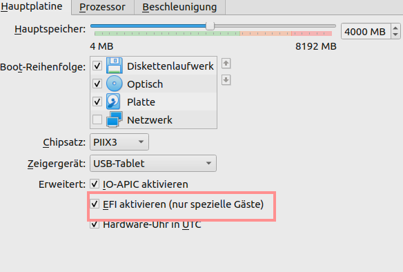
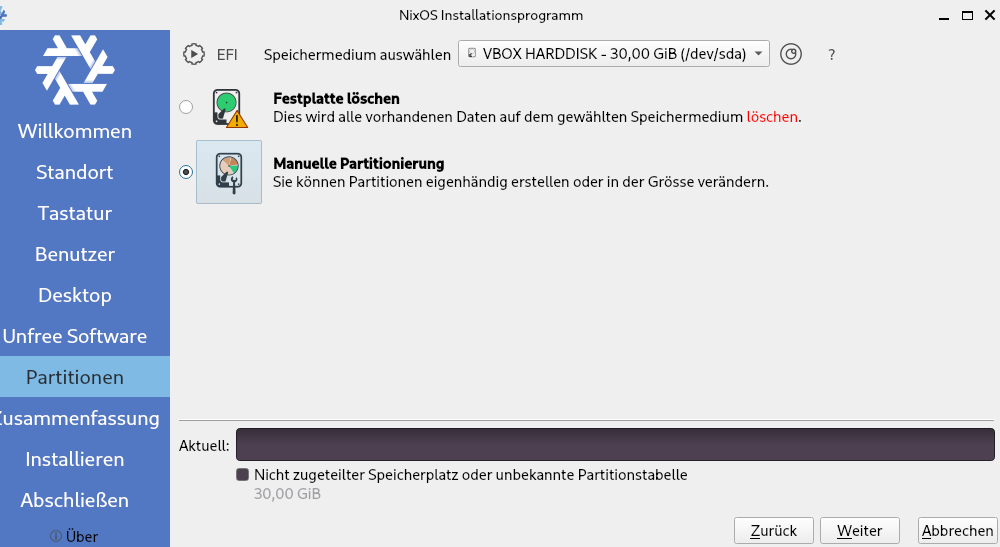
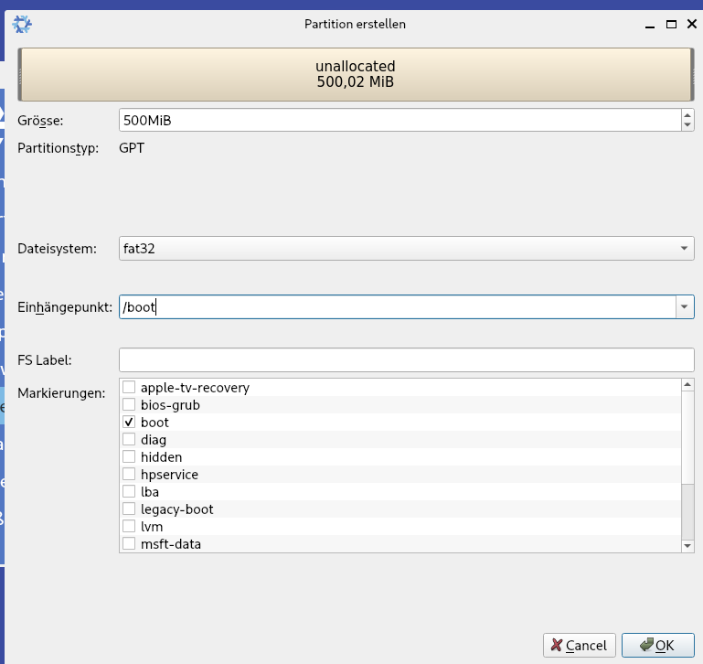
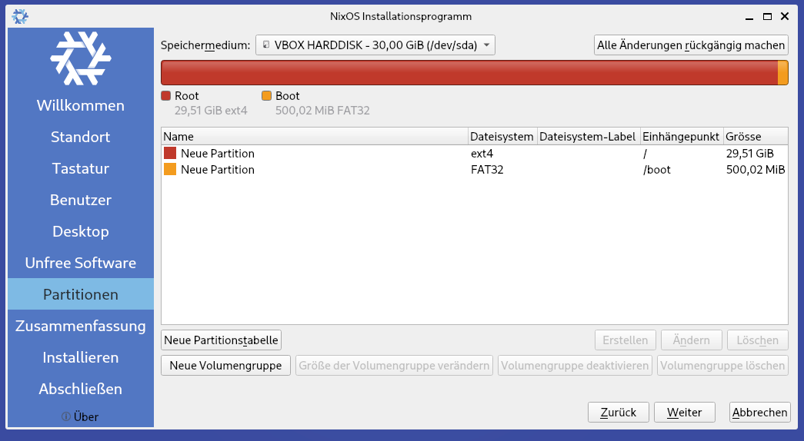

# FraLe-NixOS

## Contributors
Francesco070 &amp; XLordPlatypus

## Requirements

- min. 30GB
- Enable EFI system on your machine  (see picture)



## Installation
  
Install NixOS with the Graphical ISO Image.

During installation create 2 partitions:





> 1. partition: `/`, `ext4`

> 2. partition: `/boot`, `500 MIB`, `FAT32
 


After installing reboot:


Generate a new hardware-configuration.nix

```shell
# /etc/nixos/

sudo rm -r hardware-configuration.nix

sudo nixos-generate-config

```
Rebuild your system:

```shell 
# /home/<user>/

nix-env -iA nixos.git

git clone https://github.com/Francesco070/FraLe-NixOS.git

cp /etc/nixos/hardware-configuration.nix /home/<user>/FraLe-NixOS/hosts/<user>-nixos/hardware-configuration.nix
```

Now rebuild your system:

```shell
sudo nixos-rebuild switch --flake .#<user>-nixos
```

If there are some issues from the home-manager then delete the previous installed Git phg:

```shell
nix-env -q
# output: git-2.44.1

nix-env -e
```

## Other Commands

delete system generations older than 7 days:

```shell
nix-collect-garbage --delete-older-than 7d
```
